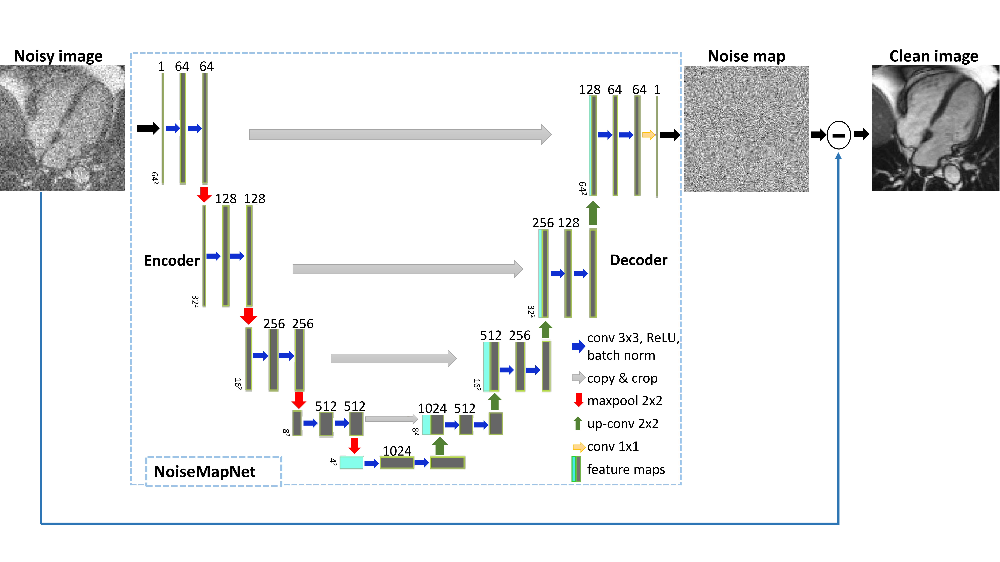

## Cardiac MRI Denoising using NoiseMapNet

> Official implementation of **NoiseMapNet** — a fast, deep learning-based denoising framework for cardiac MRI reconstructed with simultaneous multi-slice (SMS) bSSFP sequences.

  

---

## 🔍 Overview

This repository provides an implementation of **NoiseMapNet**, a U-Net-based noise estimation network that improves signal quality and diagnostic accuracy in stress perfusion cardiac MRI.

The method was proposed in the following paper:

**Adam NL, Kowalik G, Tyler A, et al. (2024)**  
[*Fast reconstruction of SMS bSSFP myocardial perfusion images using noise map estimation network (NoiseMapNet)*](https://doi.org/10.3389/fcvm.2024.1350345),  
*Frontiers in Cardiovascular Medicine*

---

## ✨ Highlights

- ✅ Accurate denoising using noise map subtraction
- ⚡ Fast inference (~6 seconds per dataset on GPU)
- 💡 Maintains spatial resolution and temporal fidelity
- 📉 Lower normalized MSE than TGRAPPA or ITER methods
- 🩺 Improved diagnostic quality with reduced artifacts

---

## 📊 Visual Results

  

*Full field-of-view comparison of image reconstructions. Left: TGRAPPA. Middle: ITER. Right: NoiseMapNet.*

---

## 🧠 Method

NoiseMapNet consists of a 2D U-Net that learns to predict a noise map from an input cardiac MR image. The denoised output is produced by subtracting this noise map.

Key components:
- Patch-based training for robust noise modeling
- Cine-based simulation of realistic noisy inputs
- Input: Noisy image
- Output: Predicted noise map
- Loss function: MSE/l2 Loss between synthetically generated noise andp redicted noise map
- Architecture based on Noise-learning UNet

## 📈 Quantitative Results
| Metric                   | TGRAPPA   | ITER          | NoiseMapNet (Ours) |
| ------------------------ | --------- | ------------- | ------------------ |
| **Myocardial NMSE ↓**    | —         | 0.172 ± 0.041 | **0.045 ± 0.021**  |
| **LV Blood Pool NMSE ↓** | —         | 0.069 ± 0.020 | **0.025 ± 0.014**  |
| **Image Quality ↑**      | 1.3 ± 0.6 | **2.7 ± 0.4** | 1.8 ± 0.4          |
| **pSNR ↑**               | 1.3 ± 0.6 | **3.0 ± 0.0** | 2.0 ± 0.0          |
| **Time per Dataset ↓**   | 30s (CPU) | 5 min (CPU)   | **6s (GPU)**       |

